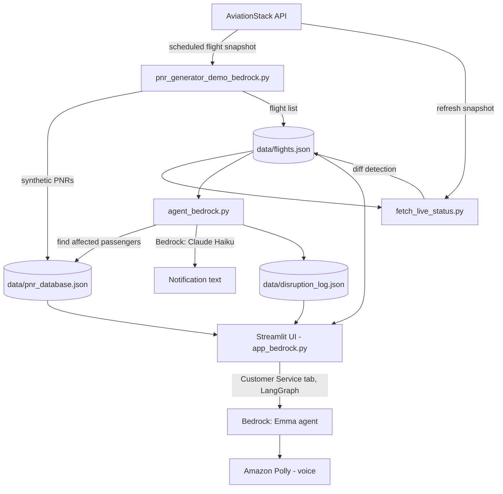

# FlightSense — Architecture & Technical Spec

**Status:** Proof of Concept
**Platform:** AWS (Bedrock, Polly)
**Author:** Dilara

---

## 1. Objective

Enable high-confidence, real-time detection of flight disruptions and establish the foundation for agentic, automated passenger servicing decisions.

## 2. Current POC Architecture

**Components:**

| Component | Role | Implementation |
|---|---|---|
| Data source | Flight schedule + status | AviationStack REST API |
| PNR generation | Synthetic passenger records for demo | Bedrock (Claude Haiku) generates fake PNRs tied to real flight numbers |
| Detection loop | Compares live snapshot vs watchlist, flags status changes | `fetch_live_status.py`, run periodically |
| Orchestration | Ties disruption → affected passengers → notification → log | `agent_bedrock.py` (Python-orchestrated, tool-defined for future agentic use) |
| Customer service | Conversational refund/rebook/voucher flow | LangGraph state machine + Bedrock (Claude Haiku) as "Emma" |
| Voice | Turns Emma's text responses into audio | Amazon Polly (neural voice) |
| UI | Flight monitor, affected passengers, live map, disruption log | Streamlit |

## 3. Data Flow

1. **Baseline fetch** — pull scheduled + already-disrupted flights from AviationStack (1 API call), generate synthetic PNRs via Bedrock.
2. **Periodic recheck** — re-fetch the same route/airport, diff against the saved watchlist, flag only genuine status changes (not full re-processing). This is what keeps API usage low against your 100-req/month cap.
3. **Disruption handling** — for each newly-disrupted, not-yet-processed flight: look up affected PNRs, generate a notification via Bedrock, log the event, mark `processed = true` so it's never re-handled.
4. **Customer service** — a human (or simulated passenger) walks through a LangGraph-driven call flow with "Emma," ending in refund / rebook / voucher, with Polly narrating Emma's side.

## 4. Success Criteria — Current Status

| Requirement | Status | Notes |
|---|---|---|
| Real-time visibility into disruptions | Partial | Detection loop works; runs on manual/interval trigger, not a live 5-min production scheduler yet |
| High-confidence source (OAG) | **Gap** | Currently AviationStack, not OAG. Reasonable substitution for a POC — OAG is a paid enterprise data source |
| PNR-level disruption intelligence | Met (synthetic) | Real PNR data not available — see Section 5 |
| Foundation for automated servicing | Met | Agent + tool-based structure (`agent_bedrock.py`) is designed to extend into a fully agentic flow |
| Scalable, agent-driven architecture | Partial | Currently Python-orchestrated rather than agent-orchestrated; tool schemas are defined but Claude isn't actually making the tool-call decisions yet — see Section 6 |
| 95–98% detection accuracy | **Not measured** | No ground-truth comparison exists in the POC to validate this |
| Detection within 5 minutes | Feasible | Architecture supports it (differential fetch is cheap); not yet running on an actual 5-min production schedule |
| Multi-source validation (OAG, TLR, Opus, ROC) | **Not started** | Only one source (AviationStack) integrated |
| Production rollout readiness | Not yet | POC proves the concept; needs real data sources, real PNR integration, and accuracy validation before rollout |

## 5. Real PNR Data — Options

You're currently using Bedrock-generated fake PNRs tied to real flight numbers, which is reasonable for a POC and wasn't a stated requirement to avoid. For a production path, real PNR data would typically come from:

- **The airline's own reservation system / PSS** (e.g. Amadeus Altéa, Sabre) — requires direct integration and airline-side data-sharing agreement.
- **A GDS (Global Distribution System)** — Amadeus, Sabre, Travelport — if AMEX's use case sits on the travel-agency side rather than the airline side.
- **AMEX's internal booking/travel systems** — since AMEX also handles hotel bookings per your note, PNR-equivalent data may already live in an internal travel management platform you'd integrate with directly rather than pull from an airline.

This is a data-access and partnership question more than a technical one — worth raising as an open question for AMEX stakeholders rather than something to solve in the POC.

## 6. Roadmap: POC → Production

1. **Swap AviationStack for OAG** once you have production data access.
2. **Add TLR / Opus / ROC as parallel data sources**, and build a simple cross-source comparison to validate the "missed flight prediction feasibility" criterion.
3. **Add an accuracy measurement harness** — compare detected disruptions against a known/logged ground truth to compute detection rate (targeting 95–98%).
4. **Move from Python-orchestrated to agent-orchestrated** — let Claude actually choose which tools to call (using the `tools` list already defined in `agent_bedrock.py`) rather than a fixed Python loop calling them in sequence. This is what "agent-driven decisioning" in the objective actually implies.
5. **Real PNR integration** — pending the data-access decision in Section 5.
6. **Production scheduler** — move `fetch_live_status.py` from manual button-click to a real 5-minute cron/EventBridge trigger.
7. **Customer service scope decision** — confirm with stakeholders whether the CS/refund flow is in scope for this POC's eval, since it wasn't in the original requirement — it may be worth demoing separately as a "vision" feature rather than folding it into the core detection success criteria.

---

*This document reflects the POC as of the current build (AWS Bedrock + LangGraph + Amazon Polly + Streamlit + AviationStack).*
